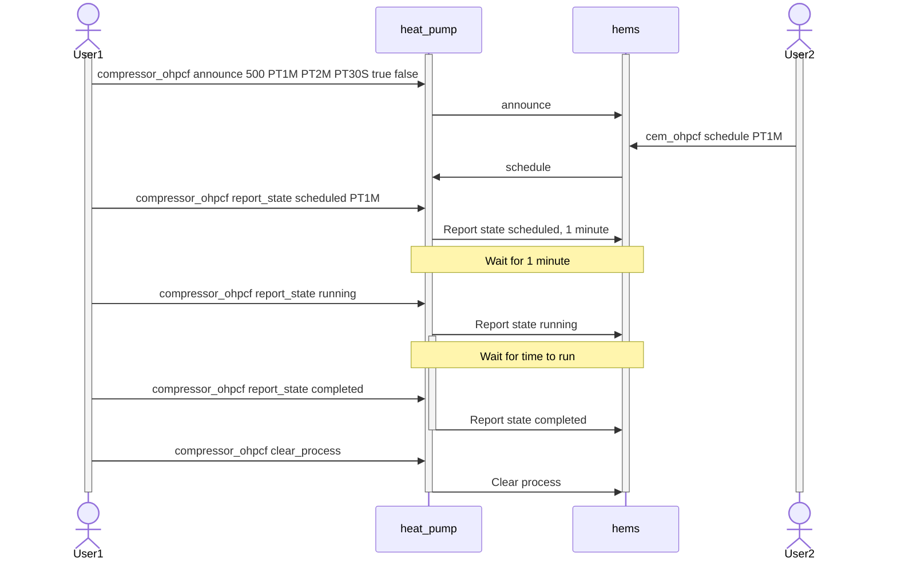

# OpenEEBUS examples
The OpenEEBUS examples provide the simplified applications containing several usecases.
The command line interface can be used to send/receive the use case related messages.

Note: set the `SHIP_CONNECTION_DEBUG 1` to see the messages being sent/received.

# Heat Pump examples
Provides sample code for the following use cases:
1. LPC (CS);
2. MPC (MU);
3. OHPCF (Compressor).
# HEMS
Provides sample code for the following use cases:
1. LPC (EG);
2. MPC (MA);
3. OHPCF (CEM).
# OHPCF CLI example
The existing example has no business logic responsible for state change,
all the actions to be performed in a kind of "forced mode" via CLI.
The sequence diagram below provides an example of normal flow of the optional power consumption simulation:

## Compressor OHPCF commands
Announce a process with earliest start time in 1 minute, latest end time in 2 minutes,
minimum active duration of 30 seconds, max power consumption of 2000.0W,
is stoppable but not pausable:

> compressor_ohpcf announce 2000.0 PT1M PT2M PT30S true false  

Report scheduled in 3 minutes from now:
> compressor_ohpcf report_state scheduled PT3M  

Report state (running/paused/completed/stopped):
> compressor_ohpcf report_state running  
> compressor_ohpcf report_state paused  
> compressor_ohpcf report_state completed  
> compressor_ohpcf report_state stopped  

Clear Process:
> compressor_ohpcf clear_process  

Get state:
> compressor_ohpcf get state  
 
## CEM OHPCF commands
Get the announce optional power consumption received values:

> cem_ohpcf get announced

Get the compressor state:
> cem_ohpcf get state

Write the schedule command to compressor:
> cem_ohpcf schedule PT10M

Write command to stop/pause/resume the compressor:
> cem_ohpcf write_command stop  
> cem_ohpcf write_command pause  
> cem_ohpcf write_command resume  
